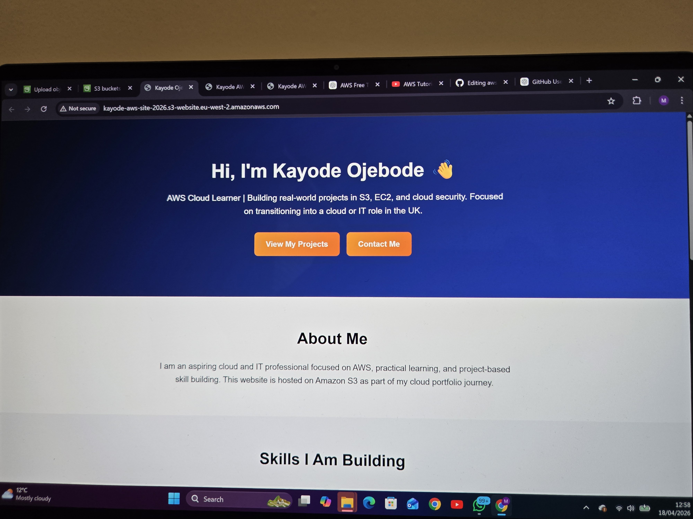
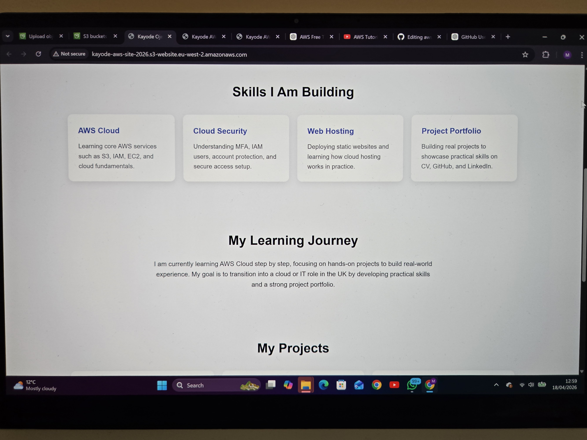
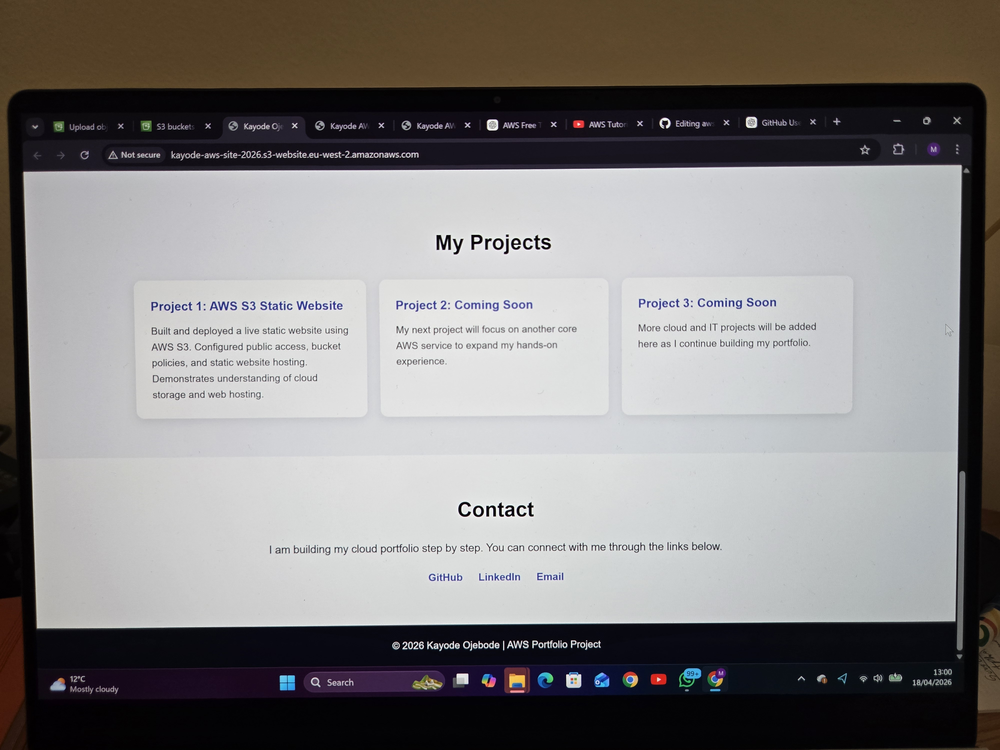
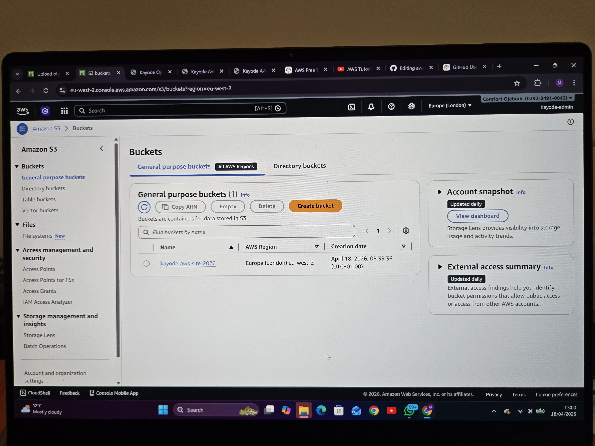

# AWS Static Website Hosting Project

## 📌 Project Overview
This project demonstrates how to host a static website using Amazon S3.

## 🚀 What I Did
- Created an S3 bucket
- Enabled static website hosting
- Uploaded website files (HTML)
- Made the website publicly accessible

## 🛠 Tools Used
- Amazon S3
- HTML
- AWS Console

## 🌐 Live Demo
(http://kayode-aws-site-2026.s3-website.eu-west-2.amazonaws.com)

## 📸 Screenshots
### Live Website

### Live Website

### Live Website

### S3 Bucket Properties

## 📚 What I Learned
- How S3 works
- Static website hosting in AWS
- Basic cloud deployment
